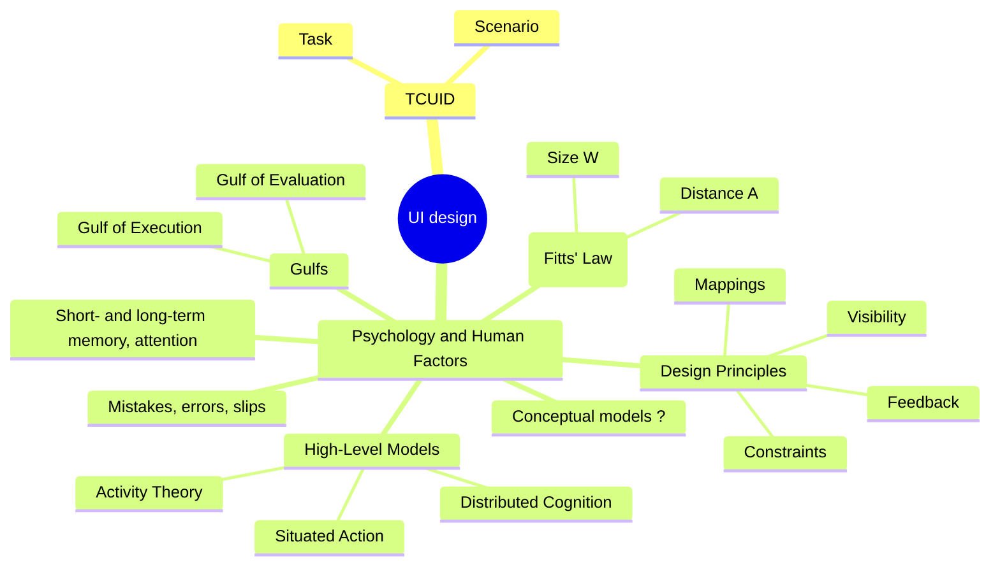

# Task-Centered User Interface Design

```mermaid
mindmap
  root((UI design))
    TCUID
      Task
      Scenario
    Psychology and Human Factors
      FL(Fitts' Law)
      ::icon(fa-solid fa-people-arrows)
        Size W
        Distance A
      Mistakes, errors, slips
      Conceptual models ?
      Gulfs
        Gulf of Execution
        Gulf of Evaluation
      Short- and long-term memory, attention
      Design Principles
        Visibility
        Feedback
        Mappings
        Constraints
      High-Level Models
        Distributed Cognition
        Activity Theory
        Situated Action
```
Fitts' Law: $a+b \cdot log_2\left(\frac{A}{W}+1\right)$
