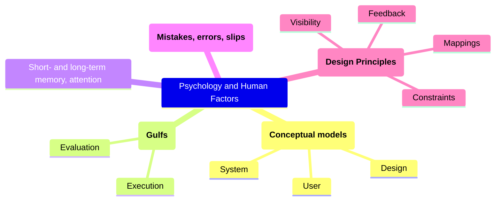

# HCID principles

## Task-Centered User Interface Design

## Psychology and Human Factors

Fitts' Law: $a+b \cdot log_2\left(\frac{A}{W}+1\right)$

### Conceptual models

- Design Model is how the designer intended system to work
- User Model is how user believes it works
- System Image is all the things about the system visible to a user

### Short-term and long-term

### Concepts to check
- [ ] [Conceptual models](#conceptual-models)
- [ ] Short-term and long-term
- [ ] Human perception
- [ ] 
