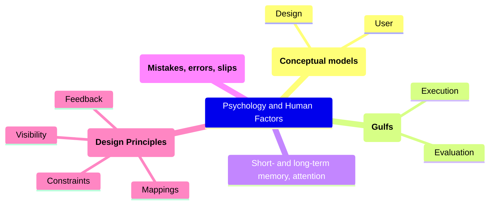

# HCID principles

## Task-Centered User Interface Design

```mermaid
mindmap
  TCUID
    Task
    Scenario
```

## Psychology and Human Factors

```mermaid
mindmap
  Psychology and Human Factors
    CM(**Conceptual models**)
      Design
      User
    G(**Gulfs**)
      Execution
      Evaluation
    Short- and long-term memory, attention
    MES(**Mistakes, errors, slips**)
    DP(**Design Principles**)
      Visibility
      Feedback
      Mappings
      Constraints
```
Fitts' Law: $a+b \cdot log_2\left(\frac{A}{W}+1\right)$
